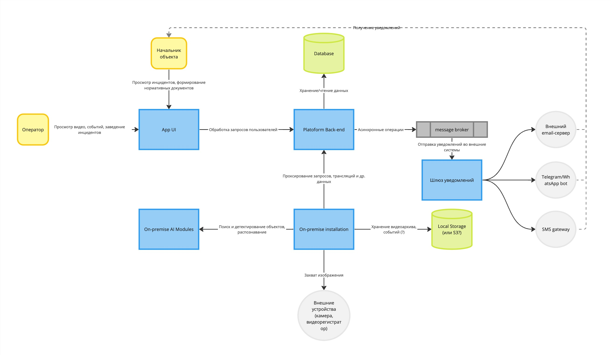

# Система мониторинга предприятия

## Бизнес-контекст и цели

Мы хотим создать систему, позволяющую предприятиям отслеживать соблюдение сотрудниками правил ТБ (ношение касок, спецодежды и пр.), их нахождение или отсутствие в определенных зонах предприятия посредством видеокамер, установленных на объекте заказчика, а при выявлении нарушения - отправлять некий alert на рабочее место оператора, по которому он сможет сформировать отчет для последующего выставления штрафа или иных действий.  

- Ориентируемся на рынок РФ/СНГ.  
- Команда разработки: 8 человек (3 backend-разработчика, 2 front-end, 1 ML engineer, 1 data scientist, 1 администратор/DevOPS)
- Количество камер: ~20-30 на одно крупное помещение (склад или цех)  
- Сетевой контур внутри предприятия может быть полностью закрытым или ограниченно открытым (исходящие соединения до 1-3 хостов)
- Каждая локальная инсталляция имеет продляемую лицензию, которая продляется раз в месяц

## Стейкхолдеры

* Директор предприятия - экономит на ручном труде операторов систем видеонаблюдения, из-за снижения количества нарушений теряет меньше выручки
* Начальник цеха/помещения - видит реальную картину на своем объекте, может поощрять или штрафовать своих работников
* Оператор системы - экономит рабочее время, необязательно должен постоянно присутствовать на рабочем месте. В роли оператора также может быть начальник цеха
* Работники предприятия - имеют дополнительный стимул для соблюдения всех правил и норм рабочего процесса
* Команда разработки - зарабатывает на реализованных контрактах

## Пользовательские истории

1. Оператор системы на своем рабочем месте логинится под своей УЗ, видит дашборд с активными/неактивными камерами. Он может посмотреть live-трансляцию или архивную трансляцию, добавить новую камеру; добавить, изменить или удалить зону на камере. В пункте "события" он может увидеть список событий, сопровождающихся скриншотом, bounding box-ом объекта (если есть), типом события, временем его наступления и указанием камеры. Может отправить инцидент.
2. Начальник цеха (или иной авторизованный пользователь) получает вовремя инциденты (в свой ЛК или Telegram/WhatsApp/на почту), по инциденту может сформировать формализованный документ (в зависимости от типа инцидента) для передачи его отделу кадров/премирования и т.п. Может смотреть отчетность по инцидентам.
3. Администратор/DevOPS подготавливает инфраструктуру для развертывания, обновляет версию приложения при апдейтах, настраивает сетевую связность, изменяет конфигурацию на различных объектах.

## Атрибуты качества
- **Нефункциональные требования** - бесперебойная работа системы (падение максимум на 2 мин), высокий SLA.
- Качество детектирования объекта (каски, спецодежды, человека в кадре), низкий процент false-positive и false-negative результатов
- Гибкость в отношении количества активных камер/трансляций, возможность масштабирования
- Удобный UI
- Бесшовные обновления
- Возможность настройки длительности хранения видеозаписей/скриншотов/событий
- Безопасность пользовательских данных (УЗ, трансляций, скриншотов, архивных записей, платежных данных)
- Гарантия доставки уведомления об инциденте

## Контекстная диаграмма

## Ключевые сценарии и характеристики
### Сценарий 1
Происходит "падение" трансляции с камеры по независящим от нас причинам.
#### Характеристики
- Время возобновления трансляции от сервиса после перезапуска камеры
- Время возобновления детектирования объектов после возобновления трансляции

### Сценарий 2
Происходит обновление ПО или моделей детекторов.
#### Характеристики
- Время рестарта всех компонентов системы

### Сценарий 3
Система сформировала событие (например, "человек в зоне")
#### Характеристики
- Скорость отправки уведомления
- Уверенность (confidence) детектора (в %)
- Количество одинаковых срабатываний (например, если человек находится в зоне продолжительное время, то каждое срабатывание - новое событие, но по факту событие одно и то же)

### Сценарий 4
Оператор системы отправил алерт.
#### Характеристики
- Временной лаг между командой на отправку уведомления и ее получением
- Процент успешно/неуспешно отправленных алертов

### Сценарий 5
Пользователь смотрит live-трансляцию с камеры.
#### Характеристики
- Latency на открытие видео по ссылке
- Задержка трансляции
- Время жизни ссылки на трансляцию

## Альтернативы и архитектурные решения
1. [Хранилище изображений](./docs/decisions/0001-image-storage.md)
2. [Алгоритмы Computer Vision](./docs/decisions/0002-cv-algos.md)